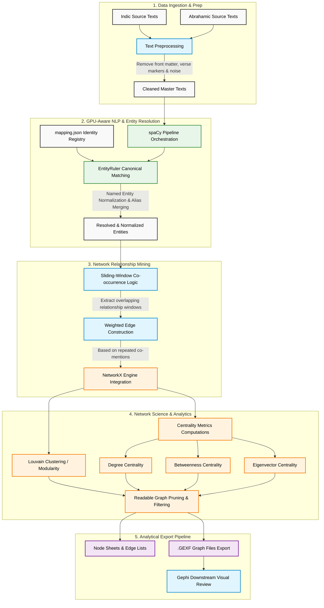
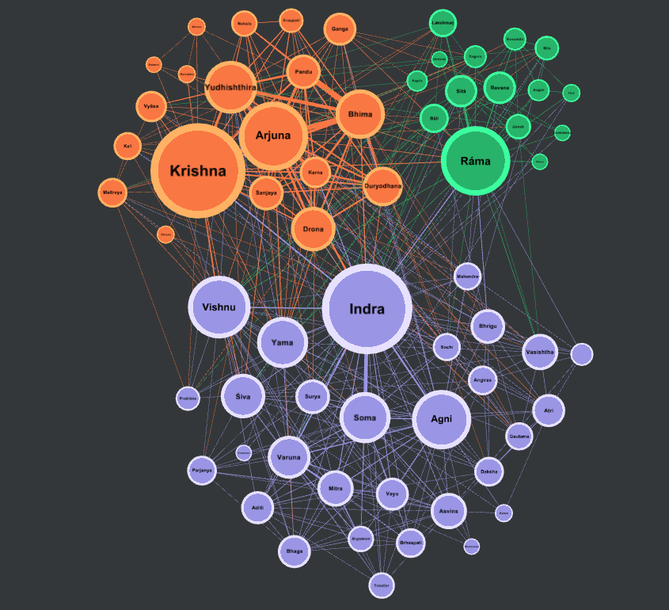
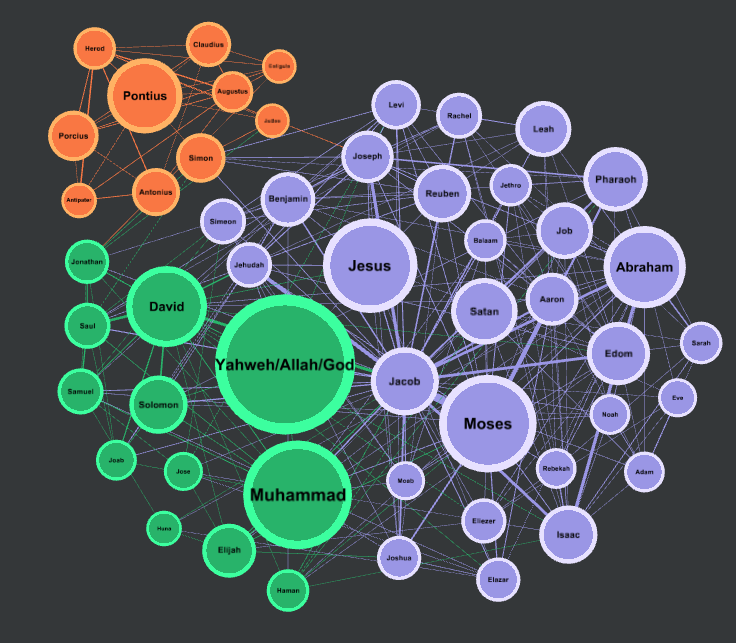

# Setu Engine

Setu Engine is a reusable network analytics engine for turning long-form text into weighted graphs. It combines NLP-driven entity resolution, sliding-window co-occurrence extraction, and graph metrics to study how people, figures, ideas, and power structures connect inside a corpus.

This project demonstrates text mining, entity normalization, graph construction, network science, GPU-aware NLP, and analytical export pipelines for Gephi and downstream review.

**Output/Dataset** repo link https://github.com/AppleDinger/Setu-dataset

## Index
1. [Tech And Features](#tech-and-features)
2. [How To Run](#how-to-run)
3. [Helper Tools](#helper-tools)
4. [Case Study](#case-study)
5. [Results](#results)
6. [Other Uses](#other-uses)
7. [Notes](#notes)

## Tech And Features

This project uses a focused stack for text analytics and graph science:

- Python for the end-to-end pipeline
- spaCy for entity extraction and NLP orchestration
- EntityRuler-based canonical matching for deterministic alias resolution
- Sliding-window co-occurrence logic for relationship mining
- Weighted edge construction from repeated co-mentions
- NetworkX for graph metrics and community detection
- Louvain clustering for modularity-based grouping
- GEXF export for Gephi visualization
- Optional GPU acceleration through spaCy / CuPy / PyTorch CUDA support
- Cleaning utilities that remove front matter, verse markers, and other noisy text artifacts
- Test scripts that verify preprocessing and matrix generation behavior

Core analytical ideas used here include:

- Named entity normalization
- Canonical identity merging
- Sliding-window graph extraction
- Degree, betweenness, and eigenvector centrality
- Connectivity and community structure comparison
- Readable graph pruning for presentation and visualization

### Technical Pipeline Architecture


## How To Run

The active pipeline lives in `run_pipeline.py`. It expects a sibling dataset workspace named `Setu-dataset` next to this repository, with raw texts available under `Setu-dataset/raw/`.

### A. Automatic Way

Run the setup script from a Bash-compatible shell.

By default, Unix-based operating systems (Linux, macOS, or Git Bash for Windows) block newly created scripts from executing as a security measure. Before running the setup script, make it executable.

```bash
chmod +x setup.sh
```

This changes the file mode so the script can run as an executable instead of a plain text file.

```bash
./setup.sh
```

The script creates a `.venv`, installs dependencies, downloads the spaCy model used by the setup flow, and ensures the sibling `Setu-dataset` workspace exists. After it finishes, activate the environment and run the pipeline.

```bash
source .venv/bin/activate
python run_pipeline.py
```

### B. Manual Way

1. Create and activate a virtual environment.

```powershell
python -m venv .venv
.\.venv\Scripts\Activate.ps1
```

2. Install the dependencies.

```powershell
pip install -r requirements.txt
```

3. Install the spaCy language model used by the pipeline.

```powershell
python -m spacy download en_core_web_md
```

4. If you want GPU acceleration, install the CUDA-matched builds listed in `requirements.txt` and make sure your local PyTorch / CuPy / spaCy CUDA stack matches your system.

5. Make sure the source texts exist in the expected raw folder structure.

```text
Setu-dataset/
	raw/
	cleaned/
	output/
```

6. Run the pipeline.

```powershell
python run_pipeline.py
```

The run produces cleaned master texts, edge lists, node sheets, and `.gexf` graph files under `Setu-dataset/cleaned/` and `Setu-dataset/output/`.

After `run_pipeline.py` finishes, open the exported `.gexf` file in Gephi or another graphing tool to actually construct, style, and inspect the network visualization.

If you want to use the sample files shipped in this repository under `data/raw/`, update `DATASET_ROOT` in `run_pipeline.py` accordingly before running.

## Helper Tools

### Name Finder

Use the name-finder helper to scan a corpus, inspect candidate person entities, and manually expand `alias mapping/mapping.json` with new canonical names and aliases.

Run it from the repository root:

```powershell
python names_finder.py
```

That wrapper forwards execution to `alias mapping/names_finder.py`, which performs the actual alias lookup and prints the top raw and canonical entities it finds.

### Tests

The repository includes small verification scripts that help validate the pipeline before you generate large graphs.

```powershell
python tests/test_preprocessing.py
python tests/test_matrix.py
```

These checks cover text cleaning, sliding-window behavior, and edge aggregation logic.

### Registry Mapping

The file `alias mapping/mapping.json` is the main identity registry. It maps variant spellings and aliases to one canonical figure so the graph does not split the same person across multiple nodes.


### Post-Processing Helpers

The repository also includes optional post-processing utilities such as `faction_resolution.py` and `src/analytics/print_summary.py` for working with community labels and structural summaries. These helpers are useful when you want to layer extra analysis on top of the exported graph data.


## Case Study

Setu Engine compares the internal social networks of Indic and Abrahamic source traditions by extracting named entities from books, connecting co-mentioned entities into weighted edges, and measuring structure through degree centrality, betweenness centrality, eigenvector centrality, and community detection. More importantly, it is designed as a general-purpose engine I built for network extraction and structural comparison across domains.

The current corpus used by the main pipeline is:

Indic sources:

- Mahabharata
- Ramayana
- Bhagavad Gita
- Rig Veda
- Vishnu Purana
- Garuda Purana
- Panchatantra

Abrahamic sources:

- King James Bible
- Quran
- Full Talmud
- Josephus Antiquities
- Josephus Wars
- Legend of the Jews

The goal is to contrast connectedness, centrality, clustering, and overall network shape across the two cultural groups.


## Results

Results of the [Case Study](https://github.com/AppleDinger/Setu-dataset/blob/main/Setu_Study_Results.docx)

### Gephi Graphs

#### Indic Network Graph

Reference profile: see Figure 3.1 from the [study](https://github.com/AppleDinger/Setu-dataset/blob/main/Setu_Study_Results.docx). The layout highlights distinct regional epic and textual factions, such as the Mahabharata and Ramayana clusters, separated by independent narrative boundaries.



#### Abrahamic Network Graph

Reference profile: see Figure 4.1 from the [study](https://github.com/AppleDinger/Setu-dataset/blob/main/Setu_Study_Results.docx). The layout highlights clear chronological structural continuity and historical successions across a highly unified, generational timeline.



### Findings

1. Key High-Centrality Figures & Theological Modeling

Indic hubs: network structure relies heavily on prominent central narrative hubs such as Krishna, Arjuna, Bhima, Yudhishthira, and Ráma, surrounded by smaller, tightly bound background characters. Theological modeling explicitly maps multiple distinct names, avatars, and contextual roles for divinity.

Abrahamic hubs: characters are evenly distributed across generational successions, including Jesus, Abraham, Moses, and Muhammad. Rather than tracking disparate regional pantheons, the network organizes around a primary shared focal entity, Yahweh/Allah/God, acting as the primary graph anchor.

2. Community Structure Observations

Faction segregation (Indic): faction lines are clearly segregated by independent text traditions, including Vedic, Epic, and Puranic. For instance, the Rig-Vedic pantheonic faction, with Indra, Agni, and Soma, features a dense web of lower relative edge weights compared to the highly integrated, heavy-connection-weight Mahabharata epic faction.

Structural continuity (Abrahamic): boundaries between sub-contexts are fluid. While separate historic spheres exist, such as the Roman administrative faction with Pontius and Porcius, they maintain high levels of cross-referencing and linear structural timeline traces defined by chronological generations.

3. Density and Connectivity Notes

Indic repository: displays a higher overall interconnection rate within its structural canvas ($0.19580$) and roughly double the local clustering probability ($0.0211$) compared to the Abrahamic set. This signals a highly interconnected, recursive, and non-linear cross-referencing pattern within narrative clusters.

Abrahamic repository: features a larger unique entity pool of 110 nodes but a more sparse, linear distribution ($0.12143$ density). This results from its chronological nature, which limits direct interaction paths between figures separated by generations.

### Statistics

The following empirical baseline metrics were calculated with NetworkX and exported to Gephi using matching case-sensitive tabular schemas.

| Topological Vector | Indic Repositories | Abrahamic Repositories | Empirical Distinction |
| --- | ---: | ---: | --- |
| DOCX Node Count (Entity Pool) | 78 | 110 | Core vocabulary and unique entity sizes. |
| Edge Count (Pruned Links) | 588 | 728 | Total validated interaction paths. |
| Graph Density | 0.19580 | 0.12143 | Interconnection rate across the structural canvas. |
| Clustering Coefficient | 0.0211 | 0.0095 | Local clustering probability within neighboring factions. |
| Network Diameter | 3 | 4 | Maximum structural steps between separated entities. |
| Average Path Length | 1.91 | 2.24 | Average separation distance between any two nodes. |

#### Top Topological Nodes Overview

Top degree centrality hubs:

- Indic: Krishna, Arjuna, Indra, Ráma
- Abrahamic: Yahweh/Allah/God, Moses, Jesus, Abraham

Top betweenness and bridge nodes:

- Indic: central figures bridging independent text boundaries, such as Vishnu connecting Vedic and Epic clusters
- Abrahamic: lineal figures connecting chronological eras, such as Jacob, Abraham, and shared baseline entities connecting the Biblical and Islamic factions

Top eigenvector nodes:

- Indic: core members of the tightly interconnected Mahabharata cluster, including Krishna, Arjuna, Bhima, and Yudhishthira
- Abrahamic: primary central focus nodes and their immediate structural successions within the central cluster

## Other Uses

With small changes to the source texts, canonical registry, and extraction rules, this engine can be reused for:

- Modern politics and election analysis
- Global relations and diplomatic narrative mapping
- Company workflow and organizational network analysis
- Internal communication pattern analysis across teams
- Epic and poetic literature analysis
- Historical chronicle comparison
- Character interaction graphs for novels and plays
- Translation comparison across multiple editions of the same text
- Organizational or knowledge-graph style co-occurrence analysis


## Notes

- Keep `mapping.json` from the dataset repo in sync with the names you expect to study, otherwise the same figure may appear as multiple nodes.
- Re-run the helper name finder after adding a new corpus or translation.
- Large corpora can create very dense graphs, so adjust window size, stride, and pruning thresholds carefully.
- For Gephi work, open the exported `.gexf` file from `Setu-dataset/output/graphs/`.
- If spaCy GPU initialization fails, the pipeline falls back to CPU mode.
- The best results come from clean source texts, consistent canonical naming, and a mapping registry that is reviewed by hand.
